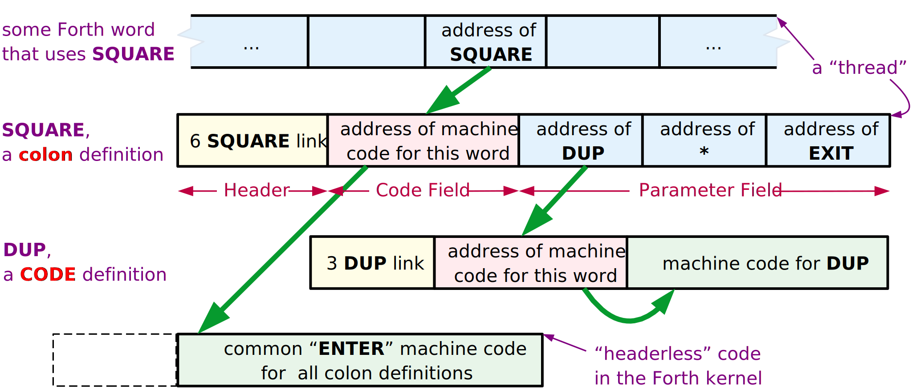
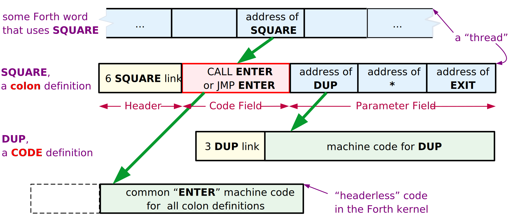
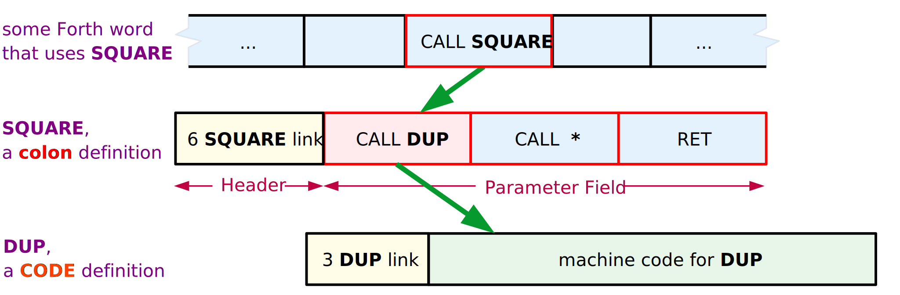
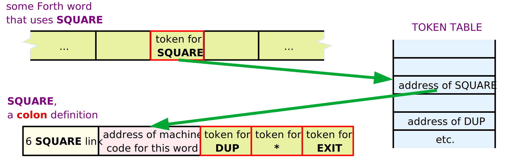

# MOVING FORTH 1

Part 1: Design Decisions in the Forth Kernel  
by Brad Rodriguez

This article first appeared in [The Computer Journal (TCJ) #59 (January/February 1993)](./README.md#the-computer-journal-tcj).

## INTRODUCTION

Everyone in the Forth community talks about how easy it is to port Forth to a new CPU. But like many "easy" and "obvious" tasks, not much is written on how to do it\! So, when [Bill Kibler](http://www.forth.org/resumes/kibler_bill.html) suggested this topic for an article, I decided to break with the great oral tradition of Forthwrights, and document the process in black and white. Over the course of these articles I will develop Forths for the [6809](http://en.wikipedia.org/wiki/Motorola_6809), [8051](http://en.wikipedia.org/wiki/Intel_8051), and [Z80](http://en.wikipedia.org/wiki/Zilog_Z80). I'm doing the 6809 to illustrate an easy and conventional Forth model; plus, I've already published a 6809 assembler [[ROD91](#ROD91)] [[ROD92](#ROD92)], and I'll be needing a 6809 Forth for future [TCJ](http://archive.org/details/the-computer-journal/) projects. I'm doing the 8051 Forth for a University project, but it also illustrates some rather different design decisions. The Z80 Forth is for all the [CP/M](http://en.wikipedia.org/wiki/CP\/M) readers of TCJ, and for some friends with [TRS-80](http://en.wikipedia.org/wiki/TRS-80)s gathering dust.

## THE ESSENTIAL HARDWARE

_You_ must choose a CPU. I will not delve into the merits of one CPU over another for Forth, since a CPU choice is usually forced upon you by other considerations. Besides, the object of this article is to show how to move Forth to _any_ CPU.

You can expect the usual 16-bit Forth kernel (see below) to occupy about 8 kBytes of program space. For a full kernel that can compile Forth definitions, you should allow a minimum of 1 kByte of RAM. To use Forth's block-management system for disk storage, you should add 3 kBytes or more for buffers. For a 32-bit Forth model, double these numbers.

These are the _minimums_ to get a Forth kernel up and running. To run an application on your hardware, you should increase PROM and RAM sizes to suit.

## 16 OR 32 BIT?

The word size used by Forth is not necessarily the same as that of the CPU. The smallest practical Forth is a 16-bit model; i.e., one which uses 16-bit integers and 16-bit addresses. The Forth community calls this the "cell" size, since "word" refers to a Forth definition.

8-bit CPUs almost invariably support 16-bit Forths. This usually requires explicit coding of double-byte arithmetic, although some 8-bit CPUs do have a few 16-bit operations.

16-bit CPUs commonly run 16-bit Forths, although the same double-precision techniques can be used to write a 32-bit Forth on a 16-bit CPU. At least one 32-bit Forth has been written for the 8086/8088.

32-bit CPUs normally run 32-bit Forths. A smaller Forth model rarely saves code length or processor time. However, I know of at least one 16-bit Forth written for the [68000](http://en.wikipedia.org/wiki/Motorola_68000). This _does_ shrink application code size by a factor of two, since high-level Forth definitions become a string of 16-bit addresses rather than a string of 32-bit addresses. (This will become evident shortly.) Most 68000s, though, have plenty of RAM.

All of the examples described in this article are 16-bit Forths running on 8-bit CPUs.

## THE THREADING TECHNIQUE

"Threaded code" is the hallmark of Forth. A Forth "thread" is just a list of addresses of routines to be executed. You can think of this as a list of subroutine calls, with the CALL instructions removed. Over the years many threading variations have been devised, and which one is best depends upon the CPU and the application. To make a decision, you need to understand how they work, and their trade-offs.

### Indirect Threaded Code (ITC)

This is the classical Forth threading technique, used in [fig-Forth](http://www.forth.org/fig-forth/contents.html) and [F83](http://github.com/ForthHub/F83), and described in most books on Forth. All the other threading schemes are "improvements" on this, so you need to understand ITC to appreciate the others.

Let's look at the definition of a Forth word SQUARE:

```forth
: SQUARE  DUP * ;
```

In a typical ITC Forth this would appear in memory as shown in [Figure 1](#FIG01). (The **Header Field** will be discussed in a future article; it holds housekeeping information used for compilation, and isn't involved in threading.)

<span id=FIG01></span>
*Figure 1. Indirect Threaded Code*



Assume SQUARE is encountered while executing some other Forth word. Forth's Interpreter Pointer (IP) will be pointing to a cell in memory -- contained within that "other" word -- which contains the address of the word SQUARE. (To be precise, that cell contains the address of SQUARE's **Code Field** .) The interpreter fetches that address, and then uses it to fetch the contents of SQUARE's **Code Field**. These contents are yet another address -- the address of a machine language subroutine which performs the word SQUARE. In pseudo-code, this is:

*NEXT (interpreter)*

<table>                
<tr><td><nobr>    (IP) -> W    </nobr></td><td>    fetch memory pointed by IP into "W" register <br> ... W now holds address of the <b>Code Field</b>    </td></tr>
<tr><td><nobr>    IP+2 -> IP    </nobr></td><td>    advance IP, just like a program counter <br> (assuming 2-byte addresses in the thread)    </td></tr>
<tr><td><nobr>    (W) -> X    </nobr></td><td>    fetch memory pointed by W into "X" register <br> ... X now holds address of the machine code    </td></tr>
<tr><td><nobr>    JP (X)    </nobr></td><td>    jump to the address in the X register    </td></tr>
</table>

This illustrates an important but rarely-elucidated principle: _the address of the Forth word just entered is kept in W._ CODE words don't need this information, but all other kinds of Forth words do.

If SQUARE were written in machine code, this would be the end of the story: that bit of machine code would be executed, and then jump back to the Forth interpreter -- which, since IP was incremented, is pointing to the *next* word to be executed. This is why the Forth interpreter is usually called NEXT.

But, SQUARE is a high-level "colon" definition -- it holds a "thread", a list of addresses. In order to perform this definition, the Forth interpreter must be re-started at a new location: the **Parameter Field** of SQUARE. Of course, the interpreter's old location must be saved, to resume the "other" Forth word once SQUARE is finished. This is just like a subroutine call\! The machine language action of SQUARE is simply to push the old IP, set IP to a new location, run the interpreter, and when SQUARE is done pop the IP. (As you can see, the IP is the "program counter" of high-level Forth.) This is called DOCOLON or ENTER in various Forths:

*ENTER*

<table>                
<tr><td><nobr>    PUSH IP    </nobr></td><td>    onto the "return address stack"    </td></tr>
<tr><td><nobr>    W+2 -> IP    </nobr></td><td>    W still points to the <b>Code Field</b>, so W+2 is the address of the Body! (Assuming a 2-byte address -- other Forths may be different.)    </td></tr>
<tr><td><nobr>    JUMP    </nobr></td><td>    to interpreter ("NEXT")    </td></tr>
</table>

This identical code fragment is used by all high-level (i.e., threaded) Forth definitions\! That's why a pointer to this code fragment, not the fragment itself, is included in the Forth definition. Over hundreds of definitions, the savings add up\! And this is why it's called Indirect threading.

The "return from subroutine" is the word EXIT, which gets compiled when Forth sees ';'. (Some Forths call it ;S instead of EXIT.) EXIT just executes a machine language routine which does the following:

*EXIT*

<table>
<tr><td><nobr>    POP IP    </nobr></td><td>    from the "return address stack"    </td></tr>
<tr><td><nobr>    JUMP    </nobr></td><td>    to interpreter    </td></tr>
</table>

Walk through a couple of nested Forth definitions, just to assure yourself that this works.

Note the characteristics of ITC: _every_ Forth word has a one-cell **Code Field**. Colon definitions compile one cell for each word used in the definition. And the Forth interpreter must actually perform a _double_ indirection to get the address of the next machine code to run (first through IP, then through W).

ITC is neither the smallest nor the fastest threading technique. It may be the simplest; although DTC (described next) is really no more complex. So why are so many Forths indirect-threaded? Mainly because _previous_ Forths, used as models, were indirect-threaded. These days, DTC is becoming more popular.

So when should ITC be used? Of the various techniques, ITC produces the cleanest and most elegant definitions -- nothing but addresses. If you're attuned to such considerations, ITC may appeal to you. If your code fiddles around with the insides of definitions, the simplicity and uniformity of the ITC representation may enhance portability. ITC is the classical Forth model, so it may be preferred for education. Finally, on CPUs lacking a subroutine call instruction -- such as the [1802](http://en.wikipedia.org/wiki/RCA_1802) -- ITC is often more efficient than DTC.

### Direct Threaded Code (DTC)

Direct Threaded Code differs from ITC in only one respect: instead of the **Code Field** containing the address of some machine code, _the Code Field contains actual machine code itself._

I'm not saying that the complete code for ENTER is contained in each and every colon definition\! In "high-level" Forth words, the **Code Field** will contain _a subroutine call_, as shown in [Figure 2](#FIG02). Colon definitions, for instance, will contain a call to the ENTER routine.

<span id=FIG02></span>
*Figure 2. Direct Threaded Code*



The NEXT pseudo-code for direct threading is simply:

<table>                
<tr><td><nobr>    (IP) -> W    </nobr></td><td>    fetch memory pointed by IP into "W" register    </td></tr>
<tr><td><nobr>    IP+2 -> IP    </nobr></td><td>    advance IP (assuming 2-byte addresses)    </td></tr>
<tr><td><nobr>    JP (W)    </nobr></td><td>    jump to the address in the W register    </td></tr>
</table>

This gains speed: the interpreter now performs only a _single_ indirection. On the Z80 this reduces the NEXT routine -- the most-used code fragment in the Forth kernel -- from eleven instructions to seven\!

This costs space: every high-level definition in a Z80 Forth (for example) is now one byte longer, since a 2-byte address has been replaced by a 3-byte call. But _this is not universally true._ A 32-bit 68000 Forth may replace a 4-byte address with a 4-byte BSR instruction, for no net loss. And on the [Zilog Super8](http://www.zilog.com/docs/ps0146.pdf), which has machine instructions for DTC Forth, the 2-byte address is replaced by a 1-byte ENTER instruction, making a DTC Forth _smaller_ on the Super8\! 

Of course, DTC CODE definitions are two bytes shorter, since they no longer need a pointer at all\! 

I used to think that high-level definitions in DTC Forths required the use of a subroutine call in the **Code Field**. Frank Sergeant's Pygmy Forth [[SER90](#SER90)] demonstrates that a simple jump can be used just as easily, and will usually be faster.

Guy Kelly has compiled a superb review of Forth implementations for the IBM PC [[KEL92](#KEL92)], which I strongly recommend to _all_ Forth kernel writers. Of the 19 Forths he studied, 10 used DTC, 7 used ITC, and 2 used subroutine threading (discussed next). _I recommend the use of Direct-Threaded Code over Indirect-Threaded Code for all new Forth kernels._

### Jump to NEXT, or code it in-line?

The Forth inner interpreter, NEXT, is a common routine to all CODE definitions. You might keep just one copy of this common routine, and have all CODE words jump to it. (Note that you Jump to NEXT; a subroutine Call is not necessary.)

However, the speed of NEXT is crucial to the speed of the entire Forth system. Also, on many CPUs, the NEXT routine is quite short; often only two or three instructions. So it may be preferable to code NEXT in-line, wherever it is used. This is frequently done by making NEXT an assembler macro.

This is a simple speed vs. space decision: in-line NEXT is always faster, but almost always larger. The total size increase is the number of extra bytes required for in-line expansion, times the number of CODE words in the system. Sometimes there's no tradeoff at all: in a 6809 DTC Forth, an in-line NEXT is _shorter_ than a Jump instruction\!

### Subroutine Threaded Code (STC)

A high-level Forth definition is nothing but a list of subroutines to be executed. You don't need interpreters to accomplish this; you can get the same effect by simply stringing a list of subroutine calls together:

```
SQUARE: CALL DUP
        CALL *     ; or a suitable alphanumeric name
        RET
```

See [Figure 3](#FIG03). This representation of Forth words has been used as a starting point to explain Forth threading techniques to assembly language programmers [[KOG82](#KOG82)].

<span id=FIG03></span>
*Figure 3. Subroutine Threaded Code*



STC is an elegant representation; colon definitions and CODE words are now identical. "Defined words" (VARIABLEs, CONSTANTs, and the like) are handled the same as in DTC -- the **Code Field** begins with a jump or call to some machine code elsewhere.

The major disadvantage is that subroutine calls are usually larger than simple addresses. On the Z80, for example, the size of colon definitions increases by 50% -- and most of your application is colon definitions\! Contrariwise, on a 32-bit 68000 there may be no size increase at all, when 4-byte addresses are replaced with 4-byte BSRs. (But if your code size exceeds 64K, some of those addresses must be replaced with 6-byte JSRs.)

Subroutine threading _may_ be faster than direct threading. You save time by not having an interpreter, but you lose time because _every_ reference to a Forth word involves a push and pop of a return address. In a DTC Forth, only high-level words cause activity on the return stack. On the 6809 or Zilog Super8, DTC is faster than STC.

There is another advantage to STC: it dispenses with the IP register. Some processors -- like the 8051 -- are desperately short of addressing registers. Eliminating the IP can really simplify and speed up the kernel\!

_The only way to know for sure is to write sample code._ This is intimately involved with register selection, discussed in the next section.

### STC with in-line expansion; optimization; direct compilation

On older and 8-bit CPUs, almost every Forth primitive involves several machine instructions. But on more powerful CPUs, many Forth primitives are written in a single instruction. For example, on the 32-bit 68000, DROP is simply

```
    ADDQ    #4,An     where An is Forth's PSP register
```

In a subroutine-threaded Forth, using DROP in a colon definition would result in the sequence

```
BSR ...
BSR DROP  ------->   DROP: ADDQ #4,An
BSR ...   <-------         RTS
```

ADDQ is a two-byte instruction. Why write a four-byte subroutine call to a two-byte instruction? No matter how many times DROP is used, there's no savings\! The code is smaller and faster if the ADDQ is coded directly into the stream of BSRs. Some Forth compilers do this "in-line expansion" of CODE words [[CUR93a](#CUR93a)].

The disadvantage of in-line expansion is that decompiling back to the original source code becomes very difficult. As long as subroutine calls are used, you still have pointers (the subroutine addresses) to the Forth words comprising the thread. With pointers to the words, you can obtain their names. But once a word is expanded into in-line code, all knowledge of where that code came from is lost.

The advantage of in-line expansion -- aside from speed and size -- is the potential for code optimization. For example, the Forth sequence

```forth
3 +  
```

would be compiled in 68000 STC as

```
    BSR     LIT
    .DW     3 
    BSR     PLUS
```

but could be expanded in-line as a _single_ machine instruction\!

Optimizing Forth compilers is too broad a topic for this article. This is an active area of Forth language research; see, for instance, [[SCO89](#SCO89)] and [[CUR93b](#CUR93b)]. The final culmination of optimized STC is a Forth which compiles to "pure" machine code, just like a C or Fortran compiler.

### Token Threaded Code (TTC)

DTC and STC aim to improve the speed of Forth programs, at some cost in memory. Now let's move the _other_ direction from ITC, toward something slower but smaller.

The purpose of a Forth thread is to specify a list of Forth words (subroutines) to be performed. Suppose a 16-bit Forth system only had a maximum of 256 different words. Then each word could be uniquely identified by an 8-bit number. Instead of a list of 16-bit addresses, you would have a list of 8-bit identifiers or "tokens," and the size of the colon definitions would be halved\!

A token-threaded Forth keeps a table of addresses of all Forth words, as shown in [Figure 4](#FIG04). The token value is then used to index into this table, to find the Forth word corresponding to a given token. This _adds_ one level of indirection to the Forth interpreter, so it is slower than an "address-threaded" Forth.

<span id=FIG04></span>
*Figure 4. Token Threaded Code*



The principal advantage of token-threaded Forths is small size. TTC is most commonly seen in handheld computers and other severely size-constrained applications. Also, the table of "entry points" into all the Forth words can simplify linkage of separately-compiled modules.

The disadvantage of TTC is speed: TTC makes the slowest Forths. Also, the TTC compiler is slightly more complex. If you need more than 256 Forth words, it's necessary to have some open-ended encoding scheme to mix 8-bit and larger tokens.

I can envision a 32-bit Forth using 16-bit tokens, but how many 32-bit systems are size-constrained?

### Segment Threaded Code

Since there are so many 8086 derivatives in the world, segment threading deserves a brief mention. Instead of using "normal" byte addresses within a 64K segment, _paragraph_ addresses are used. (A "paragraph" is 16 bytes in the 8086.) Then, the interpreter can load these addresses into segment registers, instead of into the usual address registers. This allows a 16- bit Forth model to efficiently access the full megabyte of 8086 memory.

The principal disadvantage of segment threading is the 16-byte "granularity" of the memory space. Every Forth word must be aligned to a 16-byte boundary. If Forth words have random lengths, an average of 8 bytes will be wasted per Forth word.

## REGISTER ALLOCATION

Next to the threading technique, the usage of the CPU's registers is the most crucial design decision. It's probably the most difficult. The availability of CPU registers can determine what threading technique can be used, and even what the memory map will be\!

### The Classical Forth Registers

The classical Forth model has five "virtual registers." These are abstract entities which are used in the primitive operations of Forth. NEXT, ENTER, and EXIT were defined earlier in terms of these abstract registers.

Each of these is one cell wide -- i.e., in a 16-bit Forth, these are 16-bit registers. (There are exceptions to this rule, as you will see later.) These _may not all be CPU registers._ If your CPU doesn't have enough registers, some of these can be kept in memory. I'll describe them in the order of their importance; i.e., the bottom of this list are the best candidates to be stored in memory.

**W** is the Working register. It is used for many things, including memory reference, so it should be an address register; i.e., you must be able to fetch and store memory using the contents of W as the address. You also need to be able to do arithmetic on W. (In DTC Forths, you must also be able to jump indirect using W.) W is used by the interpreter _in every Forth word_. In a CPU having only one register, you would use it for W and keep everything else in memory (and the system would be incredibly slow).

**IP** is the Interpreter Pointer. This is used by _every Forth word_ (through NEXT, ENTER, or EXIT). IP must be an address register. You also need to be able to increment IP. Subroutine threaded Forths don't need this register.

**PSP** is the Parameter Stack (or "data stack") Pointer, sometimes called simply SP. I prefer PSP because SP is frequently the name of a CPU register, and they shouldn't be confused. Most CODE words use this. PSP must be a stack pointer, or an address register which can be incremented and decremented. It's also a plus if you can do indexed addressing from PSP.

**RSP** is the Return Stack Pointer, sometimes called simply RP. This is used by colon definitions in ITC and DTC Forths, and by _all_ words in STC Forths. RSP must be a stack pointer, or an address register which can be incremented and decremented.

If _at all possible_, put W, IP, PSP, and RSP in registers. The virtual registers that follow can be kept in memory, but there is usually a speed advantage to keeping them in CPU registers.

**X** is a working register, _not_ considered one of the "classical" Forth registers, even though the classical ITC Forths need it for the second indirection. In ITC you must be able to jump indirect using X. X may also be used by a few CODE words to do arithmetic and such. This is particularly important on processors that cannot use memory as an operand. For example, ADD on a Z80 might be (in pseudo-code)

```
POP W   POP X   X+W -> W   PUSH W 
```

Sometimes another working register, Y, is also defined.

**UP** is the User Pointer, holding the base address of the task's user area. UP is usually added to an offset, and used by high-level Forth code, so it can be just stored somewhere. But if the CPU can do indexed addressing from the UP register, CODE words can more easily and quickly access user variables. If you have a surplus of address registers, use one for UP. Single-task Forths don't need UP.

**X** -- if needed -- is more important to keep in register than UP. UP is the easiest of the Forth virtual registers to move into memory.

### Use of the Hardware Stack

Most CPUs have a stack pointer as part of their hardware, used by interrupts and subroutine calls. How does this map into the Forth registers? Should it be the PSP or the RSP?

The short answer is, _it depends_. It is said that the PSP is used more than the RSP in ITC and DTC Forths. If your CPU has few address registers, and PUSH and POP are faster than explicit reference, use the hardware stack as the Parameter Stack.

On the other hand, if your CPU is rich in addressing modes -- and allows indexed addressing -- there's a plus in having the PSP as a general-purpose address register. In this case, use the hardware stack as the Return Stack.

Sometimes you do neither\! The [TMS320C25](http://en.wikipedia.org/wiki/Texas_Instruments_TMS320)'s hardware stack is only eight cells deep -- all but useless for Forth. So its hardware stack is used _only_ for interrupts, and both PSP and RSP are general-purpose address registers. (ANS Forth specifies a minimum of 32 cells of Parameter Stack and 24 cells of Return Stack; I prefer 64 cells of each.)

You will occasionally encounter the dogma that the hardware stack "must be" the Parameter Stack, or "must be" the Return Stack. Instead, code some sample Forth primitives, such as

```forth
SWAP  OVER  @  !  +  0=  
```

and see which approach is smaller or faster. (DUP and DROP, by the way, are no test -- they're usually trivial.)

Occasionally you reach strange conclusions\! Gary Bergstrom has pointed out that a 6809 DTC Forth can be made a few cycles faster by using the 6809 user stack pointer as the _IP_; NEXT becomes a POP. He uses an index register for one of Forth's stacks.

### Top-Of-Stack in Register

Forth's performance can be improved considerably by keeping the top element of the Parameter Stack in a register\! Many Forth words (such as 0=) then don't need to use the stack. Other words still do the same number of pushes and pops, only in a different place in the code. Only a few Forth words (DROP and 2DROP) become more complicated, since you can no longer simply adjust the stack pointer -- you have to update the TOS register as well.

There are a few rules when writing CODE words:

A word which _removes_ items from the stack must pop the "new" TOS into its register.

A word which _adds_ items to the stack must push the "old" TOS onto the stack (unless, of course, it's consumed by the word).

_If you have at least six cell-size CPU registers, I recommend keeping the TOS in a register._ I consider TOS more important than UP to have in register, but less important than W, IP, PSP, and RSP. (TOS in register performs many of the functions of the X register.) It's useful if this register can perform memory addressing. [PDP-11](http://en.wikipedia.org/wiki/PDP-11)s, [Z8](http://en.wikipedia.org/wiki/Zilog_Z8)s, and 68000s are good candidates.

Nine of the 19 IBM PC Forths studied by Guy Kelly [[KEL92](#KEL92)] keep TOS in register.

I think this innovation has been resisted because of the false beliefs that a) it adds instructions, and b) the top stack element must be accessible as memory. It turns out that even such words as PICK, ROLL, and DEPTH are trivially modified for TOS-in-register.

What about buffering _two_ stack elements in registers? When you keep the top of stack in a register, the total number of operations performed remains essentially the same. A push remains a push, regardless of whether it is before or after the operation you're performing. On the other hand, buffering two stack elements in registers _adds_ a large number of instructions -- a push becomes a push followed by a move. Only dedicated Forth processors like the [RTX2000](http://en.wikipedia.org/wiki/RTX2010) and fantastically clever optimizing compilers can benefit from buffering two stack elements in registers.

### Some examples

Here are the register assignments made by Forths for a number of different CPUs. Try to deduce the design decisions of the authors from this list.

<!-- Do not edit this table. It is created in Libreoffice using a 
template (see the aux directory). -->

*Register Assignments*

<table>                
<thead>                
<tr><th>  </th><th> W </th><th> IP </th><th> PSP </th><th> RSP </th><th> UP </th><th> TOS </th><th>  </th></tr>
</thead>                
<tbody>                
<tr><td> 8086<sup>[1]</sup> </td><td> BX </td><td> SI </td><td> SP </td><td> BP </td><td> memory </td><td> memory </td><td> [<a href="#LAX84">LAX84</a>] </td></tr>
<tr><td> 8086<sup>[2]</sup> </td><td> AX </td><td> SI </td><td> SP </td><td> BP </td><td> none </td><td> BX </td><td> [<a href="#SER90">SER90</a>] </td></tr>
<tr><td> 68000 </td><td> A5 </td><td> A4 </td><td> A3 </td><td> A7=SP </td><td> A6 </td><td> memory </td><td> [<a href="#CUR86">CUR86</a>] </td></tr>
<tr><td> PDP-11 </td><td> R2 </td><td> R4 </td><td> R5 </td><td> R6=SP </td><td> R3 </td><td> memory </td><td> [<a href="#JAM80">JAM80</a>] </td></tr>
<tr><td> 6809 </td><td> X </td><td> Y </td><td> U </td><td> S </td><td> memory </td><td> memory </td><td> [<a href="#TAL80">TAL80</a>] </td></tr>
<tr><td> 6502 </td><td> Zpage </td><td> Zpage </td><td> X </td><td> SP </td><td> Zpage </td><td> memory </td><td> [<a href="#KUN81">KUN81</a>] </td></tr>
<tr><td> Z80 </td><td> DE </td><td> BC </td><td> SP </td><td> IX </td><td> none </td><td> memory </td><td> [<a href="#LOE81">LOE81</a>] </td></tr>
<tr><td> Z8 </td><td> RR6 </td><td> RR12 </td><td> RR14 </td><td> SP </td><td> RR10 </td><td> RR8 </td><td> [<a href="#MPE92">MPE92</a>] </td></tr>
<tr><td> 8051 </td><td> R0,1 </td><td> R2,3 </td><td> R4,5 </td><td> R6,7 </td><td> fixed </td><td> memory </td><td> [<a href="#PAY90">PAY90</a>] </td></tr>
</tbody>                
<tfoot><tr><td colspan="8"> <sup>[1]</sup>F83.   <sup>[2]</sup>Pygmy Forth.               </td></tr></tfoot>
</table>

"SP" refers to the hardware stack pointer. "Zpage" refers to values kept in the 6502's memory page zero, which are almost as useful as -- sometimes more useful than -- values kept in registers; e.g., they can be used for memory addressing. "Fixed" means that Payne's 8051 Forth has a single, immovable user area, and UP is a hard-coded constant.

### Narrow Registers

Notice anything odd in the previous list? The 6502 Forth -- a 16-bit model -- uses _8-bit_ stack pointers\!

It is possible to make PSP, RSP, and UP smaller than the cell size of the Forth. This is because the stacks and user area are both relatively small areas of memory. Each stack may be as small as 64 cells in length, and the user area rarely exceeds 128 cells. You simply need to ensure that either a) these data areas are confined to a small area of memory, so a short address can be used, or b) the high address bits are provided in some other way, e.g., a memory page select.

In the 6502, the hardware stack is confined to page one of RAM (addresses 01xxh) by the design of the CPU. The 8-bit stack pointer can be used for the Return Stack. The Parameter Stack is kept in page zero of RAM, which can be indirectly accessed by the 8-bit index register X. (Question for the advanced student: why use the 6502's X, and not Y? Hint: look at the addressing modes available.)

In the 8051, you can use the 8-bit registers R0 and R1 to address external RAM, provided that you explicitly output the high 8 bits of address to port 2. This allows a "page select" for two stacks.

UP is different from PSP and RSP: it simply provides a base address; it is never incremented or decremented. So it's practical to supply only the _high_ bits of this virtual register. The low bits must then be provided by whatever indexed addressing technique is used. For example, on the 6809, you can use the DP register to hold the high 8 bits of UP, and then use Direct Page addressing to access any of the 256 locations in this page. This forces all user areas to begin on an address xx00h, which is no great hardship, and limits the user area to 128 cells in length.

On the 8086 you could conceivably use a segment register to specify the base address of the user area.

## REFERENCES

<span id="CUR93a">[CUR93a]</span> [Curley, Charles](http://www.charlescurley.com/), "Life in the FastForth Lane", awaiting publication in Forth Dimensions. Description of a 68000 subroutine-threaded Forth. [[1](http://archive.org/details/Forth_Dimension_Volume_14_Number_5)] [[2](http://www.forth.org/fd/FD-V14N5.pdf)] [[3](http://www.forth.org/fd/curley2.html) [[4](http://github.com/charlescurley/realforth)]

<span id="CUR93b">[CUR93b]</span> Curley, Charles, "Optimizing in a BSR/JSR Threaded Forth", awaiting publication in Forth Dimensions. Single-pass code optimization for FastForth, in only five screens of code\! Includes listing. [[1](http://www.forth.org/fd/curley1.html)] [[2](https://archive.org/details/Forth_Dimension_Volume_14_Number_6)] [[3](http://www.forth.org/fd/FD-V14N6.pdf)]

<span id="KEL92">[KEL92]</span> Kelly, Guy M., "Forth Systems Comparisons", Forth Dimensions XIII:6 (Mar/Apr 1992). Also published in the _1991 FORML Conference Proceedings_. Both available from the Forth Interest Group, P.O. Box 2154, Oakland, CA 94621. Illustrates design trade offs of many 8086 Forths with code fragments and benchmarks -- highly recommended\! [[1](https://archive.org/details/Forth_Dimension_Volume_13_Number_6)] [[2](http://www.forth.org/fd/FD-V13N6.pdf)]

<span id="KOG82">[KOG82]</span> Kogge, Peter M., "An Architectural Trail to Threaded-Code Systems", IEEE Computer, vol. 15 no. 3 (Mar 1982). Remains the definitive description of various threading techniques. [[1](http://www.semanticscholar.org/paper/An-Architectural-Trail-to-Threaded-Code-Systems-Kogge/171f9d8fc050641d022116dafaf550debfc2a3f9)]

<span id="ROD91">[ROD91]</span> [Rodriguez, B.J.](https://dl.acm.org/profile/81100318863), "B.Y.O. Assembler", Part 1, The Computer Journal \#52 (Sep/Oct 1991). General principles of writing Forth assemblers. [[1](http://archive.org/details/the-computer-journal-52)]

<span id="ROD92">[ROD92]</span> Rodriguez, B.J., "B.Y.O. Assembler", Part 2, The Computer Journal \#54 (Jan/Feb 1992). A 6809 assembler in Forth. [[1](http://archive.org/details/the-computer-journal-54)]

<span id="SCO89">[SCO89]</span> Scott, Andrew:

- "An Extensible Optimizer for Compiling Forth", _1989 FORML Conference Proceedings_, Forth Interest Group, P.O. Box 2154, Oakland, CA 94621. Good description of a 68000 optimizer; no code provided.

- "Extensible Optimizing Compiler", Forth Dimensions XII:2 (Jul/Aug 1990). [[1](https://archive.org/details/Forth_Dimension_Volume_12_Number_2)] [[2](http://www.forth.org/fd/FD-V12N2.pdf)]

### Forth Implementations

<span id="CUR86">[CUR86]</span> Curley, Charles, _real-Forth for the 68000_, <del>privately distributed (1986)</del>. [[1](http://github.com/charlescurley/realforth)]

<span id="JAM80">[JAM80]</span> James, John S., _fig-Forth for the PDP-11_, Forth Interest Group (1980). [[1](http://www.forth.org/fig-forth/contents.html)] [[2](http://www.stackosaurus.com/figforth.html)]

<span id="KUN81">[KUN81]</span> Kuntze, Robert E., _MVP-Forth for the Apple II_, Mountain View Press (1981). [[1](https://archive.org/details/haydon90_All_About_Forth_3rd_ed)]

<span id="LAX84">[LAX84]</span> Laxen, H. and Perry, M., _F83 for the IBM PC_, version 2.1.0 (1984). Distributed by the authors, available from the Forth Interest Group or GEnie. [[1](http://github.com/ForthHub/F83)] [[2](http://forth.org/OffeteStore/1003_InsideF83.pdf)]

<span id="LOE81">[LOE81]</span> Loeliger, R. G., _Threaded Interpretive Languages_, BYTE Publications (1981), ISBN 0-07-038360-X. May be the only book ever written on the subject of creating a Forth-like kernel (the example used is the Z80). Worth it if you can find a copy. [[1](http://archive.org/details/R.G.LoeligerThreadedInterpretiveLanguagesTheirDesignAndImplementationByteBooks1981)]

<span id="MPE92">[MPE92]</span> MicroProcessor Engineering Ltd., _MPE Z8/Super8 PowerForth Target_, MPE Ltd., 133 Hill Lane, Shirley, Southampton, S01 5AF, U.K. (June 1992). A commercial product. [[1](https://www.mpeforth.com/)]

<span id="PAY90">[PAY90]</span> Payne, William H., _Embedded Controller FORTH for the 8051 Family_, Academic Press (1990), ISBN 0-12-547570-5. This is a complete "kit" for a 8051 Forth, including a metacompiler for the IBM PC. <del>Hardcopy only; files can be downloaded from GEnie</del>. Not for the novice\! [[1](http://archive.org/details/WilliamH.PayneAuth.EmbeddedControllerFORTHForThe8051FamilyBostonAcademicPress1990)]

<span id="SER90">[SER90]</span> Sergeant, Frank, _Pygmy Forth for the IBM PC_, version 1.3 (1990). Distributed by the author, available from the Forth Interest Group. Version 1.4 is now available on GEnie, and worth the extra effort to obtain. [[1](http://github.com/utoh/pygmy-forth)]

<span id="TAL80">[TAL80]</span> Talbot, R. J., _fig-Forth for the 6809_, Forth Interest Group (1980). [[1](http://www.forth.org/fig-forth/contents.html)]

*Author's note for web publication: the files formerly available on the GEnie online service are now available from the Forth Interest Group <del>FTP</del> server, <del>ftp://ftp.forth.org/pub/Forth</del> http://www.forth.org/*

